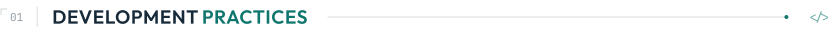
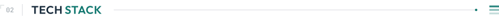
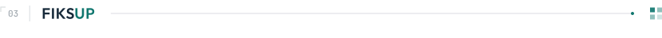

&nbsp; &nbsp; &nbsp; 

I am Richie van der Heij, a software developer from the Netherlands who works across the whole stack: architecture, backend, frontend, databases and infrastructure. Developer is my title today; engineer is the one I am growing into. At FiksUp I already do that work end to end.

In practice that means **multi-tenant B2B SaaS**: systems where each business has its own site, its own content and its own operations.

I graduated in **Software Development** from ROC Da Vinci College in Dordrecht and built production web applications during internships in several industries. Since 2025 I have been studying **Creative Media & Game Technologies** at Hogeschool Rotterdam.

<h3></h3>

- **Architecture**: I work/have worked in a monorepo — Feature-Sliced Design (FSD) on the frontend, a strict Controller → Service → Repository chain on the backend. Layers reference downward only and slices communicate through an explicit public API.
- **Multi-tenancy**: Experience with both database-per-tenant and a single shared backend/database setup, using a shared schema with application-layer guards and PostgreSQL Row-Level Security via transaction-local session variables.
- **Type safety**: TypeScript in strict mode, where `any` and suppressions count as defects. Contracts packages hold the shared shapes, TypeScript for the APIs and Zod for the content, so a changed shape breaks the build everywhere at once.
- **Enforcement**: I set the architecture up so a machine checks it: FSD layers, dependency direction and code quality are CI's job, not a reviewer's.
- **Principles**: SOLID, DRY, KISS and separation of concerns, one concern per commit.

<h3></h3>

<h4></h4>

| Layer | Stack |
| :--- | :--- |
| **Language** | TypeScript (strict mode) |
| **Frontend** | Nuxt 4 & Vue 3 (Composition API, Pinia, i18n), Next.js & React (Payload CMS) |
| **Rendering** | SSR, SSG, ISR and SPA, chosen per application |
| **Styling** | SCSS (BEM, cascade layers, design tokens) |
| **Backend** | NestJS & Node.js (versioned REST APIs, OpenAPI/Swagger) |
| **Database** | PostgreSQL & TypeORM (migration-owned schema, RLS) |
| **Quality** | ESLint, Prettier & Biome, Vitest & Playwright |
| **Tooling** | TurboRepo & pnpm workspaces (monorepo), Git & GitHub, Figma |

<h4></h4>

| Area | Stack |
| :--- | :--- |
| **Auth** | Better-Auth (sessions, cross-subdomain SSO, TOTP 2FA, organizations, argon2id), role-based access control and everything else an account layer needs |
| **Security** | rate limiting, CSP & HSTS, encrypted PII and backups, retention terms, audit logging |
| **Queues** | Redis & BullMQ |
| **Realtime** | Server-Sent Events |
| **Email** | Amazon SES & MJML |
| **Forms** | VeeValidate & Yup |
| **Accessibility** | axe-core, automated contrast gates, lint rules (WCAG 2.2 AA) |
| **Infra** | Docker & Traefik, a container and a database per client, Cloudflare R2, Sentry |
| **CI/CD** | GitHub Actions, SOPS & age (encrypted secrets) |

<h3></h3>

[**FiksUp**](https://fiksup.nl) is the platform I design, build and run. Every client gets a website on their own domain and in their own branding, a **CMS** for their content, and a **dashboard** for the daily operations around it.

The plans cover the common cases, and I take on custom work when a client needs something specific. The rest is on [fiksup.nl](https://fiksup.nl).

The source stays private, but FiksUp is open for business. A partnership, an offer, something we build together: if it works for both sides, I want to hear it.

&nbsp; &nbsp; &nbsp; &nbsp; &nbsp; 

Business inquiries: <a href="mailto:info@fiksup.nl">info@fiksup.nl</a>

<h3></h3>

Open to a developer role, product work, collaborations and good engineering conversations. I work in Dutch and English. Reach me by [mail](mailto:richievanderheij@gmail.com), on [LinkedIn](https://www.linkedin.com/in/richievdheij/), or through any of the accounts above.

<h3></h3>

My PHP work comes from internships and early projects, in codebases that were not mine: Laravel with Inertia and Vue, CodeIgniter 4 and MSSQL, next to untyped JavaScript SPAs. It is a solid base and where the way I work now comes from. I can still read and maintain all of it, but my focus moved to TypeScript.
